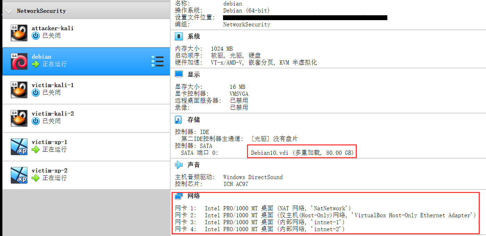
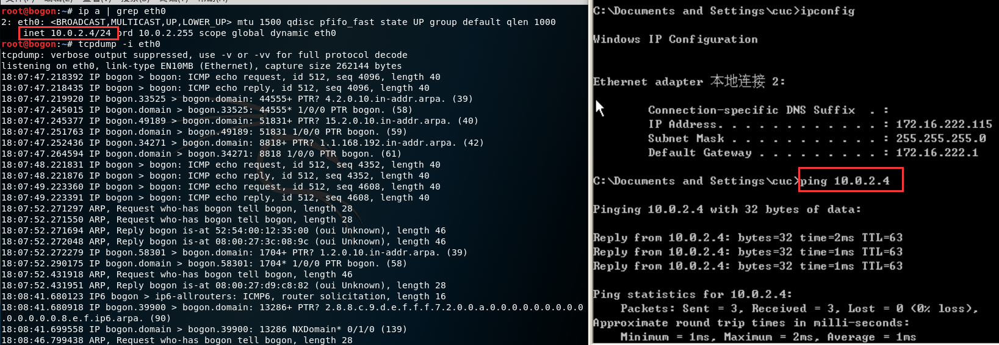
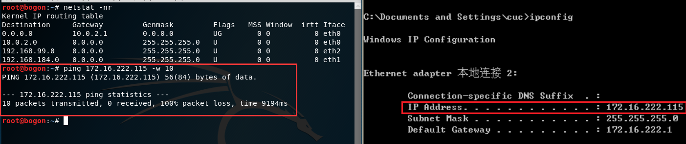
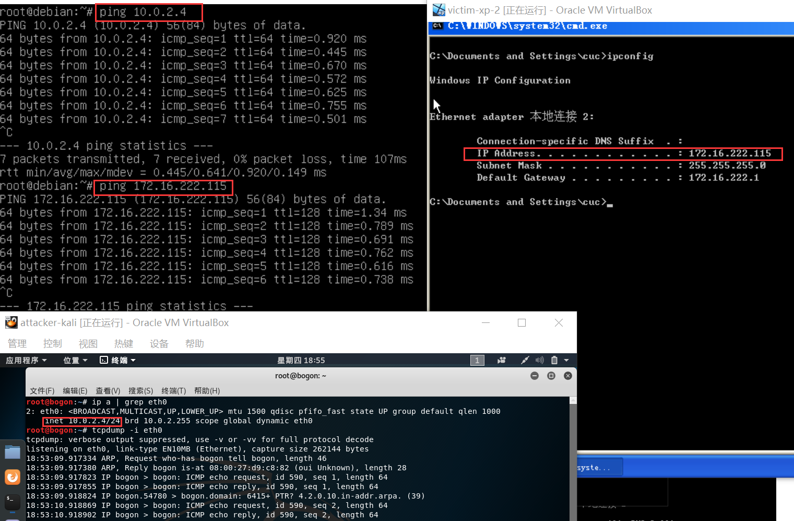
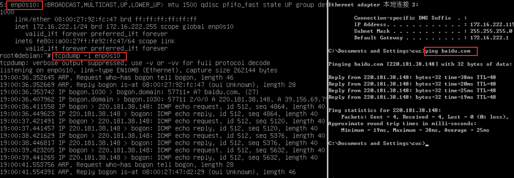

# VirtualBox网络攻防环境搭建实验报告

## 实验目的

* 实现虚拟硬盘的多重加载

* 搭建虚拟机之间的拓扑网络

  

  

  *copyright: [huangwei](https://github.com/c4pr1c3)*

* 完成以下网络连通性测试；
  * 靶机可以直接访问攻击者主机
  * 攻击者主机无法直接访问靶机
  * 网关可以直接访问攻击者主机和靶机
  * 靶机的所有对外上下行流量必须经过网关
  * 所有节点均可以访问互联网

## 实验环境

* VirtualBox版本 `6.0.11`
* 虚拟机os：
  * 攻击主机及靶机 `kali-linux-2019.3-amd64`
  * 网关 `Debian10`
  * 靶机 `windows_xp_sp3_base`

## 实验过程

### 虚拟机的多重加载

* 目的：

  * 省去再次安装系统的麻烦
* 实现：

  * 对**未注册**的虚拟硬盘文件，选择 `管理` -> `虚拟介质管理` -> `注册`，找到待注册的虚拟硬盘进行注册
  * 对**非多重加载**的虚拟硬盘文件，选择 `管理` -> `虚拟介质管理` -> `属性`， 在 `类型` 中改为 `多重加载`
* 选择`新建虚拟电脑` ->...-> `选择虚拟硬盘` ,在 **`使用已有的虚拟硬盘文件`** 中选择需要多重加载的虚拟硬盘文件，即完成了虚拟硬盘的多重加载

### 虚拟机网络预设置

#### 网络（Networking）[^1]：

* NAT网络（NAT Network）：一种允许出站连接的内部网络，防止外部系统直接访问该系统，并向内提供内部网络的相互访问，和向外使用TCP/IP网络
* 内部网络（Internal networking）：对选定的虚拟机可见，但对宿主机上的应用程序或外部世界是不可见的
* 仅主机网络（Host-only networking）：在主机上创建一个类似于环回接口的虚拟网络接口，提供虚拟机和宿主机之间的连接
* 当为一台虚拟机设置多网卡（multiple NICs），那它就同时具有了那些功能

#### 设置

* attacker-kali:
  * 设置网卡1 `NAT网络`，网卡2、3 `仅主机网络`
* debian：
  * 设置网卡1 `NAT网络`，网卡2 `仅主机网络`，网卡3、4 `内部网络 intnet-1` `内部网络 intnet-2`*（即 debain 同时属于内网1与内网2）*
* victim-xp、victim-kali：
  * 分别设置设置为  `内部网络 intnet-1` `内部网络 intnet-2`

**结果示例**

​	

### 虚拟机的连通性测试

*攻击主机 attacker-kali，网关debian，靶机victim-xp-2*

* 靶机直接访问攻击者主机
  
  * `ip a |grep eht0` 查看攻击者地址
  * `tcpdump -i eth0` 监听ping包
  * 靶机 `ping` 对方ip，观察到 `reply`；同时攻击主机显示 `icmp echo` ，说明可以直接访问
  
  

* 攻击者无法访问靶机

  - `netstat -nr` 检测网卡情况
  - `ping xx.xx.xx.xx -w 10` 设置10s超时ping靶机ip
  - 结果显示 `100% packet loss` ,说明无法访问

  

* 网关可以直接访问攻击者主机和靶机

  * ping` 攻击者主机与靶机都有 `reply` 说明成立

  

* 靶机的所有对外上下行流量必须经过网关

  * 简单测试：把网关debian开着，靶机可以ping攻击主机也可以上外网，关了debian就无法连接外网

  

  * 根据网络拓扑设置，在网关主机监听 `enp0s10` 网卡
  * 用 `intnet-2` 的主机 `ping` 外网,观察到网关同步显示 `icmp echo` 和 `ARP` ，说明结论成立

* 所有节点均可以访问互联网

  * `ping www.baidu.com` 皆可通

## 常见问题的解决

* xp靶机无法联网：
  * 关闭防火墙
  * 在 `本地连接` -> `属性` -> `常规` 中，选择`自动获取IP地址` 、`自动获取DNS服务器地址`

* kali攻击主机无法联网
  * `netstat -nr` 检查网卡端口情况
  * 如果网卡数量少于预设值， `vim /etc/network/interfaces` 添加 `auto ethx  iface ethx inet dhcp` ，即将网卡 `ethx` 设置为DHCP自动获取

[^1]: https://www.virtualbox.org/manual/ch06.html