# 常见蜜罐体验与探索实验

# 实验目的

- 了解蜜罐的分类和基本原理
- 了解不同类型蜜罐的适用场合
- 掌握常见蜜罐的搭建和使用

# 实验环境

* 蜜罐搭建：`WSL2`+`Ubuntu18.04`
* nmap扫描：`WSL2`+`Ubuntu18.04`
* SSH主机：本地`Windows 10`

# 实验原理

**蜜罐**

> 蜜罐其实就是一台无人使用但却被严密监控的网络主机,里面包含着各类虚假的高价值资源和一些已知漏洞,以此吸引入侵者来入侵该主机
> 并且在被入侵的过程中,实时记录和审计入侵者的所有入侵攻击流量,行为和数据,以此了解入侵者的攻击方式,手段和目的,便于后期快速完成对其的溯源,取证工

**低交互型蜜罐**

> A **low interaction honeypot** will only give an attacker very limited  access to the operating system. ‘Low interaction’ means exactly that,  **the adversary will not be able to interact with your decoy system in any depth**, as it is a much more static environment

**中交互型蜜罐**

> a medium interaction honeypot strategy is the best balance, providing  less risk than creating a complete physical or virtualized system to  divert attackers, but with more functionality. These would still not be  suitable for complex threats such as zero day exploits, but could target attackers looking for specific vulnerabilities. 

**高交互型蜜罐**

> A high interaction honeypot is the opposite end of the scale in  deception technology. Rather than simply emulate certain protocols or  services, **the attacker is provided with real systems to attack**, making  it far less likely they will guess they are being diverted or observed. 

**nmap扫描**

* `sudo nmap -PS`(**主机发现**)：发送一个设置了SYN标志位的空TCP报文
* `sudo nmap -sV`(**服务和版本探测**)：打开版本探测
* `sudo nmap -sS`(**端口扫描**)：SYN扫描

# 实验内容

## mysql-honeypotd

**介绍**

> Low interaction MySQL honeypot written in C.

**搭建**

```shell
sudo apt-get install libev-dev # 确保有ev.h文件
sudo apt-get install mysql-server 
sudo spt-get install inetutils-syslogd # syslog

sudo git clone https://github.com/sjinks/mysql-honeypotd.git
sudo make all
```

**开启**

```shell
sudo ./mysql-honeypotd -b 127.0.0.1 -p 2222 -u root [-s 5.7.xx]
```

* `-b`：捆绑地址
* `-t`：端口
* `-u`：用户名
* `-s`：手动设定(伪装)mysql版本

**功能**

* 模拟`mysql server`，并对尝试请求mysql连接的统一回复`Access denied`

  * 只能记录是否登陆时是否用了`password`，但无法记录`password`本身

    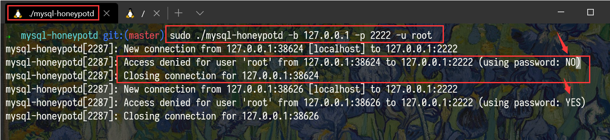 

**nmap扫描**

* `sudo nmap -PS -sS -sV localhost`

  * 结果

    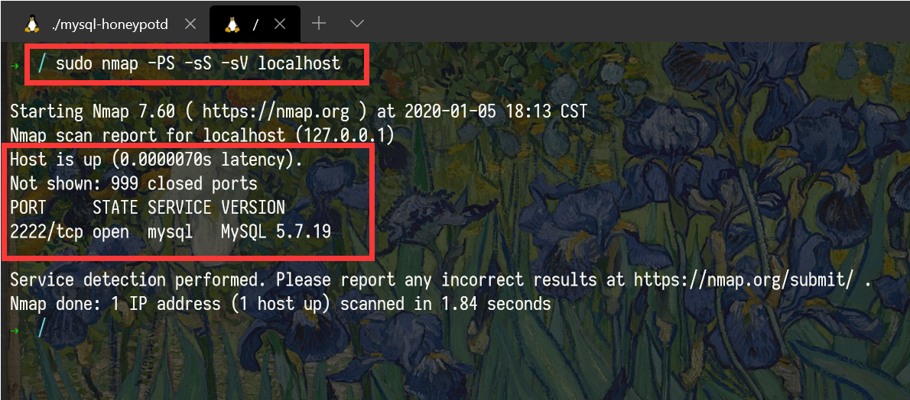 
* 可见在2222端口开启了mysql服务，版本号为`5.7.19`
  
* 手动改变版本号为`5.7.20`
  
  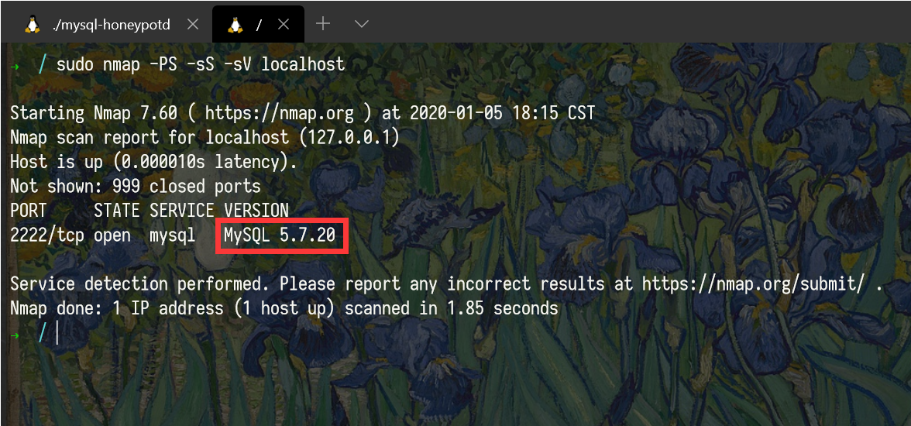 
  
* 手动改变版本号为`8.0.xx`
  
  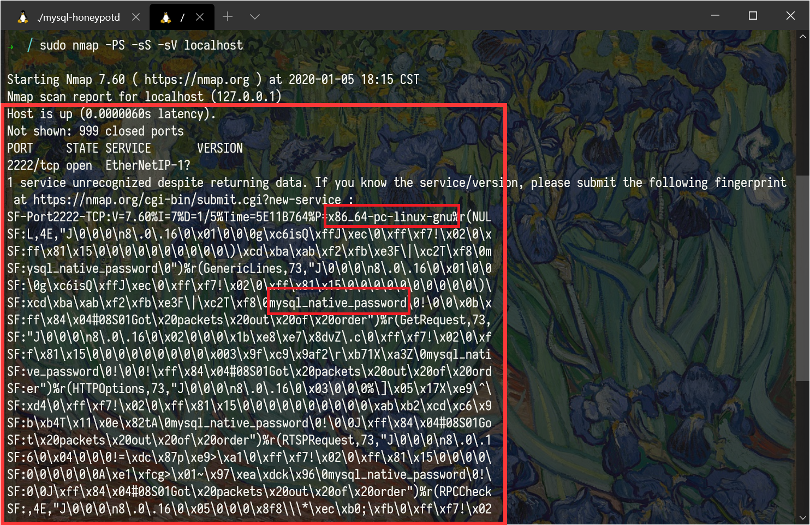 
  
  * 显然这个蜜罐不支持模拟到`mysql 8`
  
* **扫描期间蜜罐记录**
  
    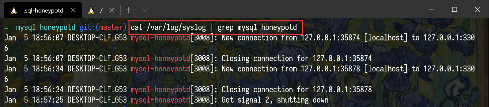 
* 显然可以发现该日志记录的行为是`扫描(或SSH等)`而非`mysql连接`，事实上我们可以对比一下正常`mysql连接`后的记录。其记录为`Access denied ...`
  
   

**识破蜜罐**

* `nmap`扫描后发现与自己部署在server上的mysql版本不一致
* 输入正确密码后仍无法连接mysql服务

## Cowrie

**介绍**

> **Cowrie is a medium interaction SSH and Telnet honeypot** designed to log brute force attacks and the shell interaction performed by the attacker.

**搭建**

```shell
sudo git clone https://github.com/cowrie/docker-cowrie.git
sudo make all  
sudo docker-compose up
```

**功能**

* 记录键盘操作，并模拟命令

  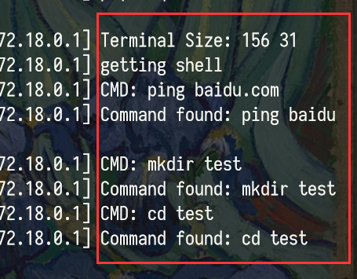 
  
* 可以模拟`访问\操作本地文件`，例如`cat`、`cp`

  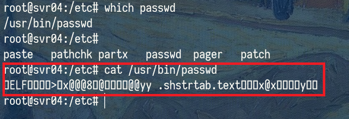 

**nmap扫描**

* `sudo nmap -PS -sS -sV localhost`

  * 结果

    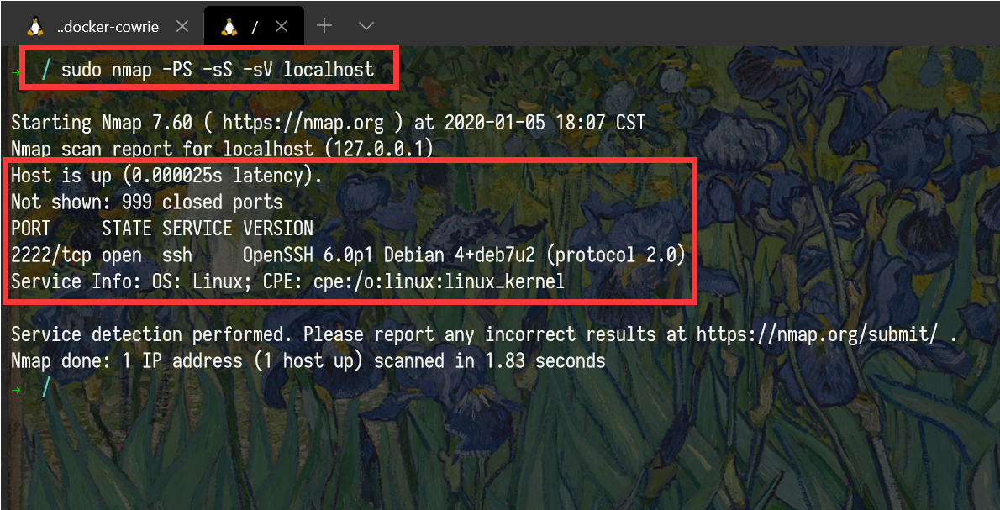 
* 可见为Debian系统、开启2222端口、SSH服务
  
* **扫描期间蜜罐记录**
  
  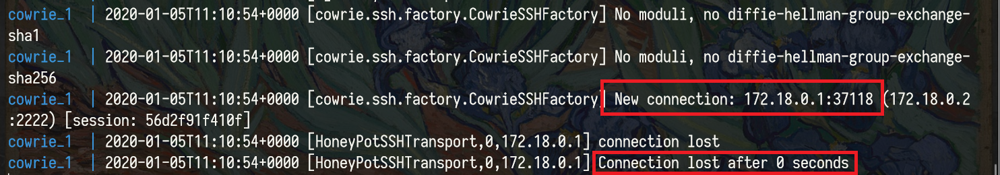 
  
  * `0 seconds`后就断开连接，显然是`扫描`，正常`SSH连接`情况下会标记为`SSHService`
  
    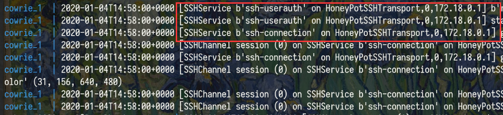 


**识破蜜罐**

* 创建的文件/文件夹在再次登录就消失了

  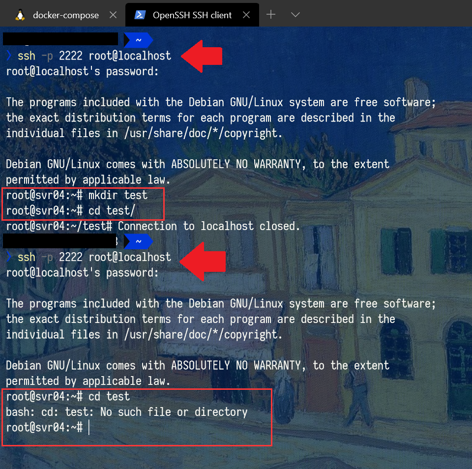 

* 无法`cat`创建的文件，即无法真实地创建**文件**，而仅仅创建了**文件目录**

  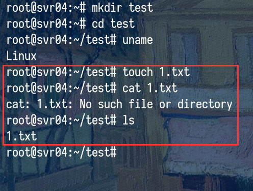 

# 参考资料

[Low, Medium and High Interaction Honeypot Security | Guardicore](https://www.guardicore.com/2019/1/high-interaction-honeypot-versus-low-interaction-honeypot/)

[蜜罐学习之ssh - cowrie](https://klionsec.github.io/2017/10/19/cowrie/)

[cowrie/cowrie: Cowrie SSH/Telnet Honeypot ](https://github.com/cowrie/cowrie#docker)

[lanjelot/twisted-honeypots: SSH, FTP and Telnet honeypots based on Twisted](https://github.com/lanjelot/twisted-honeypots)

[Nmap中文手册 - Nmap中文网](http://www.nmap.com.cn/doc/manual.shtm)