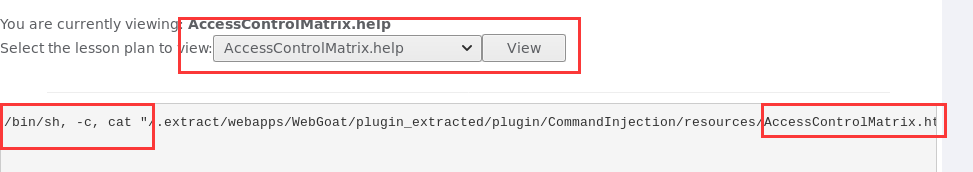
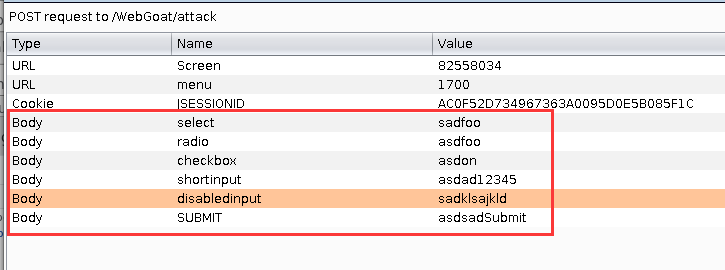

# Web 应用漏洞攻防

# 实验目的

- 了解常见 Web 漏洞训练平台；
- 了解 常见 Web 漏洞的基本原理；
- 掌握 OWASP Top 10 及常见 Web 高危漏洞的漏洞检测、漏洞利用和漏洞修复方法

# 实验环境

* `kali`主机

* `docker`

  ```shell
  sudo apt update # 解决E: 无法定位软件包 xxx
  sudo apt install docker-compose -y
  sudo apt install docker -y
  sudo apt install docker.io -y
  service docker start # Cannot connect to the Docker daemon 
  sudo docker-compose up -d servername
  
  # apt install docker-engine
  # E: 软件包 docker-engine 没有可安装候选
  ```

# 实验内容

## WebGoat

### 1. Authentication Flaws 认证缺陷—— Forgot Password 

**原理**

* Web应用为用户提供取回密码的功能，但是许多应用的实现策略实现的很差，导致用于验证用户的信息非常简单

**实验**

* 测试管理员`admin`，经过测试得到管理员最喜欢的颜色是`green`

  

**防御**

* 提高设置问题的姿势水平：答案的可能样本库要够大
* 设置多个问题

### 2. Cross-Site Scripting XSS攻击—— Stored XSS Attacks 

**原理**

> Cross-Site Scripting (XSS) attacks are a type of injection, in which malicious scripts are injected into otherwise benign and trusted websites. XSS attacks occur when an attacker uses a web application to send malicious code, generally in the form of a browser side script, to a different end user. Flaws that allow these attacks to succeed are quite widespread and occur anywhere a web application uses input from a user within the output it generates without validating or encoding it.

**实验**

* 在`Title`中输入任意值(e.g. `hack`)，`Message`输入`<script>alert(document.URL);</script>`

* 点击`Message List`中的超链接：

  
* 可以看到 ，本应该在`Message Contents`中显示的文本`<script>alert(document.URL);</script>`，却被当作Java代码被执行了

**源码漏洞**


* 可以看到由于对用户输入的`Messgae`信息中的未进行过滤，导致恶意代码得以被存储与执行。

**解决**

* `HtemlEncoder.enocode()`对特殊字符进行转义

* **验证**：观察到源码中`title`变量被转义过滤，因此，改为在`Title`中输入`<script>alert(document.URL);</script>`：

  
  
* 结果

  
  
  * 可以看到`Message Contents`正常显示了输入内容，并无任何弹窗

**防御**

* 对所有的输入进行过滤，尤其要“清理”那些将被用作参数使用的输入，这对于在应用程序中永久存储的内容特别重要——当用户的消息被检索时，不能出现不期望的消息内容

### 3. Injection Flaws注入攻击 —— Command  Injection

**原理**

> Injection flaws allow attackers to relay malicious code through an application to another system. These attacks include calls to the operating system via system calls, the use of external programs via shell commands, as well as calls to backend databases via SQL (i.e., SQL injection). Whole scripts written in Perl, Python, and other languages can be injected into poorly designed applications and executed. Any time an application uses an interpreter of any type there is a danger of introducing an injection vulnerability.

**实验**

* 观察发现该网页的信息由命令行执行输出

  

* 攻击方法一：开发者工具`DevTools`

  * 在开发者工具中找到下拉菜单框的html源码

  * 在之后添加攻击命令`"&& cat "/etc/passwd`

    

  * 点击`View`

    

* 攻击方法二：`Burpsuite`

  * 配置网络代理`proxy`，注意不能和当前`webgoat`占用的端口重合

    
* **注意：需要去掉`No proxy for`中的内容**
  
* 拦截请求后，在`Params`中修改`HelpFile`参数：添加上`"&&echo "hacked`
  
  
  
* 点击`Forward`发送请求
  
  

**源码漏洞**

* 没有对参数进行校验，同时又**预设**了输入参数的个数

  

**解决**

* 执行前对参数进行校验，检查符号`&`的个数（或再进行一次切分)

  ```javascript
  var offset = 0
  var subStr = command[2]
  do { offset = subStr.indexOf("&", offset);
    if(offset != -1)
     { count++; offset += subStr.length;
      } }while(offset != -1);
  ```

**防御**

* 根治

  * 不要从应用层代码调用操作系统命令

* 输入校验

  * 设置白名单
  * （允许的情况下，）验证输入只包含字母数字字符，没有其他语法或空白

  * 永远不要试图通过转义shell字符来消毒输入——不仅容易出错，而且很容易被熟练的攻击者绕过

### 4. Malicious Execution恶意执行——Malicious File Execution

**原理**

>  Developers will often directly use or concatenate potentially hostile input with file or stream functions, or improperly trust input files. On many platforms, frameworks allow the use of external object references, such as URLs or file system references. When the data is insufficiently checked, this can lead to arbitrary remote and hostile content being included, processed or invoked by the web server.
>
> This allows attackers to perform:
>
> - Remote code execution
> - Remote root kit installation and complete system compromise
> - Internal system compromise may be possible through the use of PHP’s SMB file wrappers

**实验**

* （可选）选择`Browser`选定一张图片，`Start Upload`上传

  * 如果`kali`本地恰好没有图片，可以利用`Firefox`截图功能：`Developer Toolbar`>`screenshot xx.png`

  * 直接`touch`一个也是可以的

    

  * `View Image Info`，记录文件运行URL为`localhost:8087/WebGoat/Uploads/homepage.png`，因此之后需要将`homepage.png`该文恶意执行的`jsp`文件，以次执行恶意代码

* 新建`hack.jsp`

  ```jsp
  <HTML>
  
  <% java.io.File file= newjava.io.File("/.extract/webapps/WebGoat/mfe_target/webgoat.txt");file.createNewFile();%>
  
  </HTML>
  ```

* 上传

  

* `copy Image Location`，新建一个`Tab`，输入复制的URL，此时恶意代码得到执行（指定目录下新建一个txt文件）

* 返回原界面，刷新，**solved**

  

**源码漏洞**

* 上传文件直接写入本地，而不对文件类型加以检查

  

**解决**

* 检测上传文件后缀名

  ```java
  String suffix = fileName.substring(fileName.lastIndexOf('.'));
  if(suffix == "png" || suffix == "jpg" || suffix == "bmp"){
      Item.write(uploaded_file_path);
  }
  ```

**防御**

* 擦除特殊命名的文件（可能会导致覆盖系统文件）

* 所有上传的文件都要进行病毒扫描。

* 限制上传大小
* 限制上传类型为预期的文件类型

### 5. Parameter Tampering参数篡改——Bypass HTML Field Restrictions

**原理**

> Parameter tampering is a form of Web-based attack in which certain parameters in the Uniform Resource Locator (URL) or Web page form field data entered by a user are changed without that user's authorization.

**实验**

* 攻击方法一：开发者工具`DevTools`

  * 在`input checkbox`中加入`value`属性

  * 在`input disable`中删除`disable=""`

  * 修改数值

    

  * 提交

* 攻击方法二：`Burpsuite`

  * 修改源码，在`input disable`中删除`disable=""`

  * 拦截请求，修改参数

    

  * 点击`Forward`，`Intercept off`关闭拦截，**solved**

    

**防御**

* 隐藏表单字段

* 添加服务器端验证

  

## JuiceShop

### 0. Find the carefully hidden 'Score Board' page

**目标**

* 找到精心隐藏的“计分板”页面

**推测**

* 藏在某一路径下，需要找到计分板页面的URL(后缀)

**实现**

* `DevTool`>`Debugger`>`main-es2015.js`>`search 'path'`

  * 优化显示:`pretty print`

* 找到`path: 'score-board'`

  

* 输入链接`/#/score-borad`，**solved**

### 1. Access a confidential document

**目标**

* 查阅机密文件

**观察**

* 查看使用条款，并用`DevTool`查看超链接

  

**推测**

* 文件存储在`/ftp`路径下

**实现**

* 访问路径`/ftp`

  

* 查看`acquisition.md`,**solved**

  

### 2. Order the Christmas special offer of 2014

**目标**

* 订购2014年圣诞节特别优惠

**观察**

* `DevTool`>`Network`,在搜索框中输入任意值

  
* 注意到`Request URL`和浏览器显示的地址不相同，相当于**Origin URL**

**猜测**

* 所有产品信息存储在`/rest/products/search`下

**实现**

* 访问`/rest/products/search`

  
* 在目录中并未找到需要的**2014 Christmas special offer**
  
* 尝试SQL注入

  * 在`search?q=`后加入`';`

    

  * 在`search?q=`后加入`'-`

    

  * 在`search?q=`后加入`'--`

    * 发现通过**注释符绕过**接近成功

    

  * 在`search?q=`后加入`'))--`

    

* 找到`2014圣诞超级惊喜礼盒`

  

* `DevTool`>`Network`，选择任意一个商品`添加到购物车`

* 修改`POST`：`Edit and Resend`

  
* `BasketId`改为`10`
  
* 查看购物车,**solved**

  

### 3. Provoke an error that is neither very gracefully nor consistently handled

**目标**

* 引发错误，该错误既不能很好的解决，也不能得到很好的处理

**观察**

* 寻找SQL注入的可能性，在`电子邮箱`中输入`'`，在`密码`输入任意值

  

### 4. Access the administration section of the store && Log in with the administrator's user account

**目标**

* 访问商品的管理界面
* 使用管理员用户账号登陆

**观察**

* `DevTool`>`Debugger`>`main-es2015.js`>`search 'path'`

* 找到`path: 'dministration`

  

* 访问`/#/administration`

  

**猜测**

* 需要通过管理员账号登陆,才能访问管理员界面.而要获得管理员权限,需要sql注入

**实现**

* 访问`/#/login`,在`电子邮箱`中输入`' or 1=1--`，在`密码`输入任意值

* 成功以管理员登陆，访问`/#/administration`，**solved\*2**

  

### 5. Post a product review as another user or edit any user's existing review

**目标**

* 以另一用户身份发布商品评论或编辑任何已有的用户评论

**观察**

* `DevTool`>`Network`，提交一个评论

  

**实现**

* `Edit and Resend`，修改`email`和`author`

  

* **solved**

  

# 参考资料

**XSS**

* [Cross-site Scripting (XSS) - OWASP](https://www.owasp.org/index.php/Cross-site_Scripting_(XSS))

**Injection Flaws**

* [Injection Flaws - OWASP](https://www.owasp.org/index.php/Injection_Flaws)

* [Injection Flaws -1  | 宅學習](https://sls.weco.net/node/24446)

* [What is OS command injection, and how to prevent it?](https://portswigger.net/web-security/os-command-injection)

**Malicious Execution**

* [Top 10 2007-Malicious File Execution - OWASP](https://www.owasp.org/index.php/Top_10_2007-Malicious_File_Execution)

* [Pen Testing: Malicious File Execution – risk3sixty LLC](https://www.risk3sixty.com/2015/01/08/pen-testing-malicious-file-execution/)

**Parameter Tampering**

* [What is parameter tampering? - Definition from WhatIs.com](https://searchsecurity.techtarget.com/definition/parameter-tampering)
* [Lim Jet Wee - YouTub](https://www.youtube.com/channel/UCZBLudnz327HIkCrSlixrpw)

**Juice Shop**

* [Pwning OWASP Juice Shop -  Björn Kimminich ](https://bkimminich.gitbooks.io/pwning-owasp-juice-shop/content/)