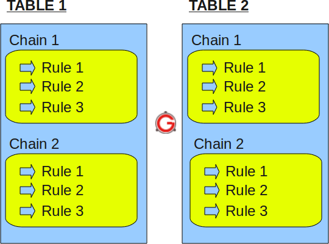

# iptables实验

# 实验目的

* 了解和熟悉iptables规则

# 实验环境

* 假定如下局域网拓：
  
  ```
  +----------------------+          +-------------------------+       +----------------------+     
  |     host-1           |          |   host-2                |       |     host-3           |  
  |     172.16.18.11     |          |   eth0:0 172.16.18.1    |       |     172.16.18.12     |  
  |                      |          |   eth0: 192.168.1.123   |       |                      |  
  +-------------+--------+          +----------+--------------+       +-------------+--------+  
                |                              |                                    |
                |                              |                                    |
       +--------+------------------------------+--+                                 |
       |                交换机                    |---------------------------------+
       +-----------------+------------------------+
                         |
                         |
                   +-----+-----------+
                   |   eth0          |   `
                   |   192.168.1.1   |
                +--+-----------------+---------+
                |                              |
                |        host-gw / dns-svr     |
                |                              |
                +------------------+----------++
                                   |  eth1    |
                                   +----------+
  ```
  
  * host-1上配置了默认网关指向 IP 地址：172.16.18.1，域名解析服务器配置为 IP：192.168.1.1
  * host-3上配置了默认网关指向 IP 地址：172.16.18.1，域名解析服务器配置为 IP：192.168.1.1

# 实验原理

**Temporary virtual network interface（临时虚拟网卡）**

```shell
$ifconfig eth0:0
eth0:0    Link encap:Ethernet  HWaddr 3c:97:0e:02:98:c8  
          UP BROADCAST MULTICAST  MTU:1500  Metric:1
          Interrupt:20 Memory:f1600000-f1620000 

$ifconfig eth0:0 123.123.22.22
$ifconfig eth0:0
eth0:0    Link encap:Ethernet  HWaddr 3c:97:0e:02:98:c8  
          inet addr:123.123.22.22  Bcast:123.255.255.255  Mask:255.0.0.0
$ping 123.123.22.22
PING 123.123.22.22 (123.123.22.22) 56(84) bytes of data.
64 bytes from 123.123.22.22: icmp_req=1 ttl=64 time=0.060 ms
64 bytes from 123.123.22.22: icmp_req=2 ttl=64 time=0.057 ms
```

**iptables**

* 结构

  * `Table`>`Chain`>`Rule`

    

* 表与内建链

  * Filter表（默认表）
    * **INPUT链** – 当经过路由判断后，要进入本机的数据包执行的规则
    * **OUTPUT链** – 由本机产生，需向外发的数据包执行的规则
    * **FORWARD链** – 目的地不是本机，并需要将其**路由**到最终地址或下一跳的数据包执行的规则
  * NAT表
    * **PREROUTING链** – 处理刚到达本机并在路由转发前的数据包。它会转换数据包中的目标IP地址，通常用于DNAT(destination NAT)
      * 系统是先进入 DNAT，然后才进入路由及过虑等操作
      * 保存翻译的映射关系到内存
    * **POSTROUTING链** – 处理即将离开本机的数据包。它会转换数据包中的源IP地址，通常用于SNAT(source NAT)
      * 需要注意的是，系统在路由及过虑等处理直到数据包要被送出时才进入 SNAT
      * 保存翻译的映射关系到内存
    * **OUTPUT链** – 处理本机产生的数据包
  * Mangle表
  * Raw表

* 规则

  * 格式：`iptables [-t 表] 命令 匹配 动作`
  
  * 命令
  
    | 命令                      | 说明                               |
    | :------------------------ | :--------------------------------- |
    | -P或--policy <链名>       | 定义默认策略                       |
    | -L或--list <链名>         | 查看iptables规则列表               |
    | -A或--append <链名>       | 在规则列表的最后增加1条规则        |
    | -I或--insert <链名>       | 在指定的位置插入1条规则            |
    | -D或--delete <链名>       | 从规则列表中删除1条规则            |
    | -R或--replace <链名>      | 替换规则列表中的某条规则           |
    | -F或--flush <链名>        | 删除规则列表中所有规则             |
    | -Z或--zero <链名>         | 将表中数据包计数器和流量计数器归零 |
    | -X或--delete-chain <链名> | 删除空的规则列表                   |
    | -N或--new-chain <链名>    | 新建规则列表                       |
  
    * `-F`与`-X`区别
  
      ```
      -F
      +---------------+       +---------------+
      |               |       |               |
      | Chain MyChain |       | Chain MyChain |
      |     Rule 1    |  -F   |      is       |
      |     Rule 2    |       |     empty     |
      |     Rule 3    |  ==>  |               |
      |               |       |               |
      +---------------+       +---------------+
      -X
      +---------------+
      |               |
      | Chain MyChain |         Chain MyChain
      |      is       |  -X      does not exist
      |     empty     |
      |               |  ==>
      |               |
      +---------------+
      ```
  
  * 匹配
  
    | 匹配                | 说明                                                         |
    | :------------------ | :----------------------------------------------------------- |
    | -i<网络接口名>      | 指定数据包从哪个网络接口进入，如ppp0、eth0和eth1等           |
    | -o<网络接口名>      | 指定数据包从哪块网络接口输出，如ppp0、eth0和eth1等           |
    | -p<协议类型>        | 指定数据包匹配的协议，如TCP、UDP和ICMP等，默认为all          |
    | -s<源地址或子网>    | 指定数据包匹配的源地址                                       |
    | --sport <源端口号>  | 指定数据包匹配的源端口号，可以使用“起始端口号:结束端口号”的格式指定一个范围的端口 |
    | -d<目标地址或子网>  | 指定数据包匹配的目标地址                                     |
    | --dport<目标端口号> | 指定数据包匹配的目标端口号，可以使用“起始端口号:结束端口号”的格式指定一个范围的端口 |
    | -j                  | 决定当与规则匹配时如何处理数据包                             |
    | -m state            | 启用状态匹配模块                                             |
    | -–tcp-flags         | (**针对-p tcp**)可以指定由逗号分隔的多个参数，有效值可以是：SYN, ACK, FIN, RST, URG, PSH |
    | –-state             | 状态匹配模块的参数。NEW、ESTABLISHED、RELATED                |
  
    > * **NEW** meaning that the packet has started a new connection, or otherwise associated with a connection which has not seen packets in both directions
    > * **ESTABLISHED** meaning that the packet is associated with a connection which has seen packets in both directions
    > * **RELATED** meaning that the packet is starting a new connection, but is associated with an existing connection, such as an FTP data transfer, or an ICMP error
    > * **INVALID** meaning that the packet could not be identified for some reason which includes running out of memory and ICMP errors which don't correspond to any known connection
  
  * 动作
  
    | 动作       | 说明                                                         |
    | :--------- | :----------------------------------------------------------- |
    | **基本**   |                                                              |
    | ACCEPT     | 接受数据包                                                   |
    | DROP       | 丢弃数据包                                                   |
    | QUEUE      | 将数据包移交到用户空间                                       |
    | RETURN     | 停止执行当前链中的后续Rules，并返回到调用链(the calling chain)中 |
    | **拓展**   |                                                              |
    | REDIRECT   | 将数据包重新转向到本机或另一台主机的某个端口，通常用功能实现透明代理或对外开放内网某些服务 |
    | SNAT       | 源地址转换，即改变数据包的源地址                             |
    | DNAT       | 目标地址转换，即改变数据包的目的地址                         |
    | MASQUERADE | IP伪装，即是常说的NAT技术，MASQUERADE只能用于ADSL等拨号上网的IP伪装，也就是主机的IP是由ISP分配动态的；如果主机的IP地址是静态固定的，就要使用SNAT |
    | LOG        | 日志功能，将符合规则的数据包的相关信息记录在日志中，以便管理员的分析和排错 |
  
  * **RETURN**
  
    > 顾名思义，它使包返回上一层，顺序是：子链——>父链——>缺省的策略。具体地说，就是若包在子链 中遇到了RETURN，则返回父链的下一条规则继续进行条件的比较，若是在父链（或称主链，比如INPUT）中 遇到了RETURN，就要被缺省的策略（一般是ACCEPT或DROP）操作了
  
  * **SNAT**
  
    > 比如，多个PC机使用ADSL路由器共享上网，每个PC机都配置了内网IP。PC机访问外部网络的时候，路由器将数据包的报头中的源地址替换成路由器的ip，当外部网络的服务器比如网站web服务器接到访问请求的时候，他的日志记录下来的是路由器的ip地址，而不是pc机的内网ip。这是因为，这个服务器收到的数据包的报头里边的“源地址”，已经被替换了。
  
  * **DNAT**
  
    > 典型的应用是，有个web服务器放在内网配置内网ip，前端有个防火墙配置公网ip。互联网上的访问者使用公网ip来访问这个网站。当访问的时候，客户端发出一个数据包，这个数据包的报头里边，目标地址写的是防火墙的公网ip。防火墙会把这个数据包的报头改写一次，将目标地址改写成web服务器的内网ip，然后再把这个数据包发送到内网的web服务器上。这样，数据包就穿透了防火墙，并从公网ip变成了一个对内网地址的访问了
  
  * **MASQUERADE**
  
    > 地址伪装，在iptables中有着和SNAT相近的效果，但也有一些区别:
    >
    > * 用SNAT的时候，出口ip的地址范围可以是一个，也可以是多个
    >
    >   ```sh
    >   iptables -t nat -A POSTROUTING -s 10.8.0.0/255.255.255.0 -o eth0 -j SNAT --to-source 192.168.5.3-192.168.5.5
    >   ```
    >
    > * 如上👆命令表示把所有10.8.0.0网段的数据包SNAT成192.168.5.3/192.168.5.4/192.168.5.5等几个ip然后发出去。但是，对于SNAT，不管是几个地址，必须明确的指定要SNAT的ip（而这可能会动态变化）
    >
    > * MASQUERADE就是针对这种场景而设计的，他的作用是，从服务器的网卡上，自动获取当前ip地址来做NAT
  
* **查看特定表的规则**：`iptables -t <table> --list`

* **默认策略定义**：`iptables [-t 表名] <-P 默认策略> <链名> <动作>`

  * 当数据包不属于链中任何规则时，iptables将根据该链预先定义的默认策略处理数据包

* 0.0.0.0/0

  > 在路由器配置中可用0.0.0.0/0表示默认路由，作用是帮助路由器发送路由表中无法查询的包。如果设置了全零网络的路由，路由表中无法查询的包都将送到全零网络的路由中去。严格说来，0.0.0.0已经不是一个真正意义上的IP地址了。它表示的是这样一个集合：所有未知的主机和目的网络。
  > 这里的“未知”是指在本机的路由表里没有特定条目指明如何到达

# 实验内容

## 解释host-2 上的 iptables 配置脚本

```sh
#!/bin/bash

IPT="/sbin/iptables"

$IPT --flush
# 清空所有链中所有规则
$IPT --delete-chain
# 删除所有空链

$IPT -P INPUT DROP
# INPUT链默认DROP规则，即默认丢包
$IPT -P FORWARD DROP
# FORWARD规则DROP规则，即默认丢包
$IPT -P OUTPUT ACCEPT
# OUTPUT链默认ACCEPT规则，即默认输出

$IPT -N forward_demo
# 新建forward_demo链
$IPT -N icmp_demo
# 新建icmp_demo链

$IPT -A INPUT -i lo -j ACCEPT
# 允许回环网卡数据输入
$IPT -A OUTPUT -o lo -j ACCEPT
# 允许回环网卡数据输出

$IPT -A INPUT -p tcp ! --syn -m state --state NEW -s 0.0.0.0/0 -j DROP
# 丢弃所有不包含SYN的、建立TCP请求的包
$IPT -A INPUT -m state --state ESTABLISHED,RELATED -j ACCEPT
# 接收所有入站TCP数据包
$IPT -A INPUT -p icmp -j icmp_demo
# 对ICMP包接收，跳转到icmp_demo链上规则处理

$IPT -A icmp_demo -p icmp -i eth0 -j ACCEPT
# 接收eth0进入的icmp包
$IPT -A icmp_demo -j RETURN
# 从子链（当前icmp_demo链）返回父链（调用链），即丢包

$IPT -A FORWARD -j forward_demo
# forward_demo处理路由转发

$IPT -A forward_demo -j LOG --log-prefix FORWARD_DEMO
# 把forward_demo链的日志记录到命名前缀为FORWARD_DEMO的日志
$IPT -A forward_demo -p tcp --dport 80 -m string --algo bm --string 'baidu' -j DROP
# 禁止转发URL里有‘baidu’的tcp包
$IPT -A forward_demo -p tcp -s 172.16.18.11 -j ACCEPT
# 转发来自host-1的tcp包
$IPT -A forward_demo -p tcp -d 172.16.18.11 -j ACCEPT
# 转发前往host-1的tcp包
$IPT -A forward_demo -p udp -s 172.16.18.11 --dport 53 -j ACCEPT
# 转发来自host-1的udp包
$IPT -A forward_demo -p udp -s 172.16.18.1  --dport 53 -j ACCEPT
#  转发来自host-2的udp包
$IPT -A forward_demo -p udp -s 192.168.1.1  --sport 53 -j ACCEPT
#  转发来自host-gw的udp包
$IPT -A forward_demo -p tcp -s 192.168.1.1 -j ACCEPT
# 转发自host-gw的的tcp包 
$IPT -A forward_demo -s 172.16.18.1 -j RETURN
# 对来自host-2的数据包，转父链处理，即丢包
$IPT -t nat -A POSTROUTING -s 172.16.18.1/24 -o eth0 -j MASQUERADE
# 对172.16.18.1/24网段的数据包，动态读取eth0的ip做SNAT然后输出
```

## 思考

**1. host-1可以ping通ip: 172.16.18.1吗?**

* 可以

> 根据`$IPT -A icmp_demo -p icmp -i eth0 -j ACCEPT`，接收eth0进入的icmp包；同时注意到hsot-2配置了虚拟网卡eth0:0，故host-2接收来自host-1的`echo requset`；而根据`$IPT -P OUTPUT ACCEPT`，host-2将返回`echo reply`，故可以ping通

**2. host-1可以ping通ip: 192.168.1.1吗？**

* 可以

> 因为host-2式host-1的默认网关，所以携带icmp的以太网帧会先到达host-2。同1题，host-2接收来自host-1的icmp包，而此时**源地址**需要从172.16.18.x/24路由转到192.168.1.x/24(**SNAT**)，根据`$IPT -t nat -A POSTROUTING -s 172.16.18.1/24 -o eth0 -j MASQUERADE`，做了ip转换后输出，最终到达host-gw.
>
> 假设host-gw接收`echo request`，返回`echo reply`，host-2将将目的地址做DNAT（**这不是依赖于iptables的规则，而是依赖于之前内存保存的翻译的映射关系，反过来使用**），并最终送达host-1

**3. host-1可以ping通域名:www.baidu.com吗？**

* 不可以

> * `$IPT -A forward_demo -p tcp --dport 80 -m string --algo bm --string 'baidu' -j DROP`，`host-2`禁止转发URL里有‘baidu’的包，而`host-1`的默认网关是`host-2`，需要经由`host-2`转发到`dns-svr`，故无法ping通
>

**4. host-1可以访问:http://61.135.169.121 吗？**

* 可以

> host-1发送以太网帧到host-2，host-2做动态ip转换再发给host-gw，host-gw做nat发送最终的`http get`
>
> host-gw发送`http response`到host-2，host-2做DNAT，返回给host-1

**5. host-3可以ping通ip: 172.16.18.1吗？**

* 可以

> 原因见1

**6. host-3可以ping通ip: 192.168.1.1吗？**

* 可以

> 原因见2

**7. host-3可以访问互联网吗？**

* 基本可以

> 除了URL带‘baidu’的

# 参考资料

[iptables详细教程：基础、架构、清空规则、追加规则、应用实例 - Lesca 技术宅](http://lesca.me/archives/iptables-tutorial-structures-configuratios-examples.html)

[linux - Delete a iptables chain with its all rules - Server Fault](https://serverfault.com/questions/375981/delete-a-iptables-chain-with-its-all-rules)

[What is the difference between iptables -X and iptables -F? - Server Fault](https://serverfault.com/questions/656091/what-is-the-difference-between-iptables-x-and-iptables-f)

[IP地址 0.0.0.0 是什么意思？ - xiluhua - 博客园](https://www.cnblogs.com/xiluhua/p/10657917.html)

[iptables(8) - Linux man page （**Recommend**）](https://linux.die.net/man/8/iptables)

[iptables之FORWARD转发链  -Linux_woniu-51CTO博客](https://blog.51cto.com/linuxcgi/1965296)

[IPtables中SNAT和MASQUERADE的区别-操作系统- (**Recommend**)](http://server.zhiding.cn/server/2008/0317/772069.shtml)

[Configuring virtual network interfaces in Linux - LinuxConfig.org](https://linuxconfig.org/configuring-virtual-network-interfaces-in-linux)

[Forward Ping reques - LinuxQuestions.org (**Recommend**)](https://www.linuxquestions.org/questions/linux-security-4/forward-ping-request-4175615657/)