# 入侵检测实验

# 实验目的

* 了解和熟悉`Snort`、`Suricata`和`Guardian`

# 实验环境

搭建拓扑环境

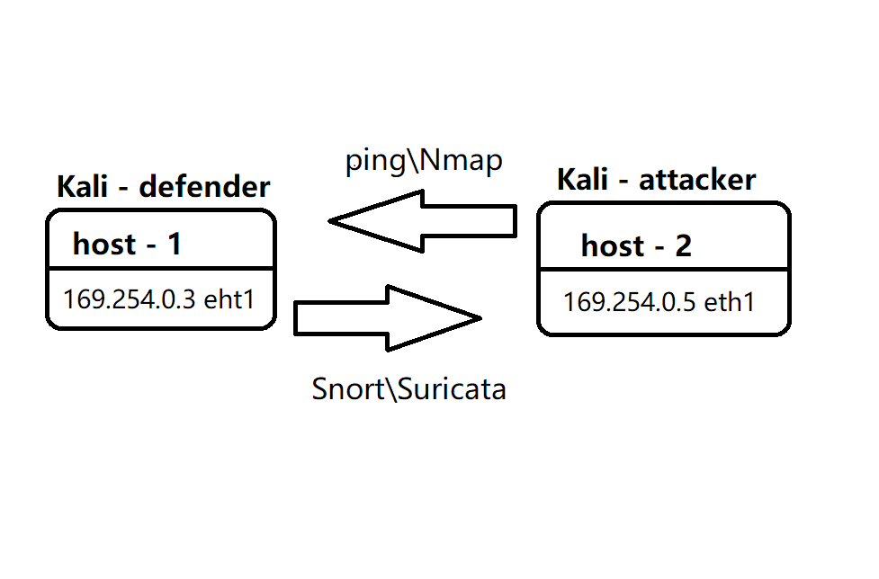

# 实验原理

## 入侵检测

**定义**

* **入侵检测**将识别对网络的非常规访问。这种访问可能非常“复杂”——例如更改 DNS 表，使得对一个站点的请求权不重定向到其他由黑客控制的域中，或使用一个更加随意的文件来替代 Apache Web 服务器上的 .htaccess 文件，允许黑客添加、删除和更改用户信息 —— 包括密码在内。

**原理**

* **嗅探**网络流量

**IDS**

* 入侵检测系统(Intrusion Detection System)

**NIDS**

* 基于网络的入侵检测系统(Network Intrusion Detection System, NIDS)

## snort

**简介**

> *Snort* is an open-source, free and lightweight network intrusion detection system (NIDS) software for Linux and Windows to detect emerging threats.

**工作模式**

> Snort can be configured to run in three modes: 
>
> * Sniffer mode, which simply reads the packets off of the network and displays them for you in a continuous stream on the console (screen). 
> * Packet Logger mode, which logs the packets to disk. 
> * Network Intrusion Detection System (NIDS) mode, which performs detection and analysis on network traffic. This is the most complex and configurable mode.

* 包(一组格式化的数据)嗅探器：嗅探模式

  * 从网络上读取数据包并作为连续不断的流显示在终端上

    ```shell
    03/31-08:55:12.180121 192.168.1.102:64864 -> 239.255.255.253:427
    UDP TTL:1 TOS:0x0 ID:10294 IpLen:20 DgmLen:64
    Len: 36
    ```

* 包记录器：报文记录模式

  * 将包记录到选定的目录中

    ```shell
    $cd /var/log/snort/ $$ ls
    snort.log.1206998502
    $date -d @1206998502
    Tue Apr  1 05:21:42 DST 2008
    ```

* NIDS模式

  > 从根本上来说，包嗅探和包记录（以及对这些记录的分析）都是入侵检测系统(IDS)的子系统。
  >
  > 由于入侵的类型不断迅速变化,您可从 Snort 的站点下载新的规则

**编写规则**

> Snort rules are divided into two logical sections, the rule header and the rule options.
>
> * The rule header contains the rule's action, protocol, source and destination IP addresses and netmasks, and the source and destination ports information. 
> * The rule option section contains alert messages and information on which parts of the packet should be inspected to determine if the rule action should be taken.

**删除规则**

> To manually disable a Snort rule, open the rule file and insert a pound sign (#) in front of the rule

## suricata

**简介**

> Suricata is a high performance Network IDS, IPS and Network Security Monitoring engine. It is open source and owned by a community-run non-profit foundation, the Open Information Security Foundation (OISF). Suricata is developed by the OISF.

**工作模式**

* IDS
  * 入侵检测系统（Intrusion Detection Systems）
  * real time intrusion detection
* IPS
  * 入侵防御系统（Intrusion Prevention System）
  * inline intrusion prevention
* NSM
  * network security monitoring

**编写规则**

> A rule/signature consists of the following:
>
> - The **action**, that determines what happens when the signature matches
> - The **header**, defining the protocol, IP addresses, ports and direction of the rule.
> - The **rule options**, defining the specifics of the rule.

`reject`

> This is an active rejection of the packet. Both receiver and sender receive a reject packet. There are two types of reject packets that will be automatically selected. If the offending packet concerns TCP, it will be a Reset-packet. For all other protocols it will be an ICMP-error packet. Suricata also generates an alert. When in Inline/IPS mode, the offending packet will also be dropped like with the ‘drop’ action

**管理规则**

> By default suricata-update will merge all rules into a single file “/var/lib/suricata/rules/suricata.rules”

* To enable rules that are disabled by default, use ‘/etc/suricata/enable.conf’

* To disable rules use /etc/suricata/disable.conf

  ```shell
  2019401                   # enable/disable this sid
  group:emerging-icmp.rules # enable/disable this rulefile
  re:trojan                 # enable/disable all rules with this string
  ```

* 更新规则

  * `sudo suricata-updatey`

## Guardian

**简介**

> Guardian是基于Snort+iptables的一个主动防火墙，它分析Snort的日志文件，根据一定的判据自动将某些恶意的IP自动加入iptables的输入链，将其数据报丢弃。

---

# 实验内容

## 0. 安装

### Snort 

```shell
# 禁止在apt安装时弹出交互式配置界面
export DEBIAN_FRONTEND=noninteractive

sudo apt install snort
```

### Suricata 

* `sudo apt-get install suricata`

## 1. 开启嗅探模式

### Snort

* `snort -qvi eth1 `

**结果**

* `kali-victim`主机显示ping信息

  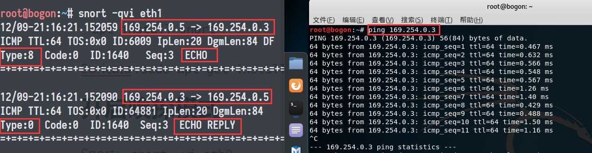


### Suricata

* `suricata -vi eth1`

**结果**

* `kali-victim`主机显示接收到包

  

## 2. 启用内置规则并开启嗅探

### Snort

* `snort -i eth1 -c /etc/snort/snort.conf -q -A console -b -l /var/log/snort/`

**结果**

* 相比实验1，内容上大差不差，显示效果上有区别

  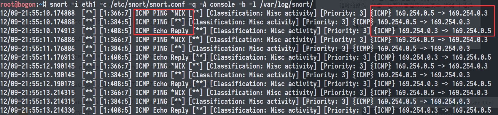

**Suricate**

* `suricata -i eth1 -c /etc/suricata/suricata.yaml`

**结果**

* 现象与实验1相似

* 查看日志

  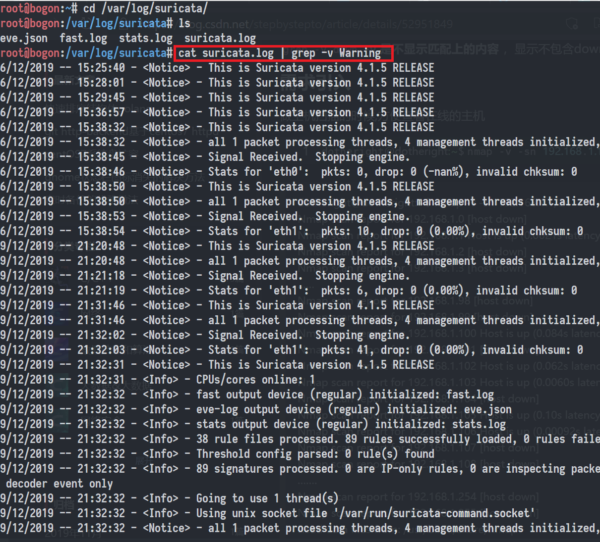

## 3. 自定义snort规则

### Snort

```shell
# 新建自定义 snort 规则文件
cat << EOF > /etc/snort/rules/cnss.rules
reject icmp 169.254.0.5 any <> 169.254.0.3 any (msg:"Blocking ICMP Packet from 169.254.0.5";sid:1000001;rev:1)
EOF

# 添加配置代码到 /etc/snort/snort.conf
include $RULE_PATH/cnss.rules

snort -q -A fast -b -i eth1 -c /etc/snort/snort.conf -l /var/log/snort/
```

**配置`snort.conf`**

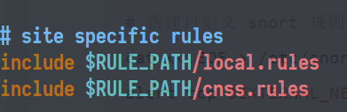

**结果**

* `kali-attakcer`主机无法ping通（`reject icmp`）

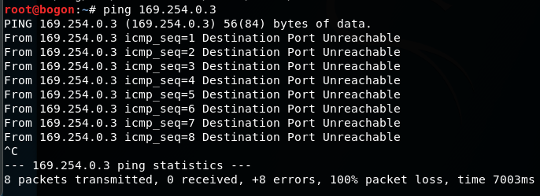

* 日志对比

  * 在未添加规则前（即只是用默认规则时）

    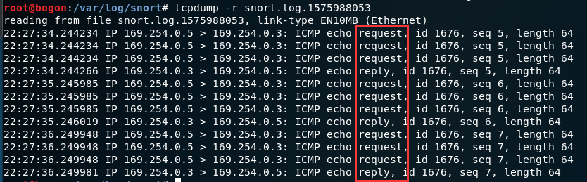

  * 添加规则后，只有`icmp echo request`，而没有`icmp echo reply`

    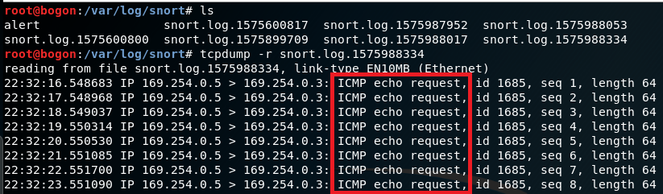

### Suricata

```shell
# 注意末尾分号不要漏否则会报错"no terminating ";" found"
cat << EOF > /etc/suricata/rules/local.rules
alert icmp 169.254.0.5 any <> 169.254.0.3 any (msg:"Informing ICMP Packet from 169.254.0.5";sid:1000001;rev:1;)
EOF

# 添加配置代码到 /etc/suricata/suricata.yaml
 - local.rules

suricata -i eth1 -c /etc/suricata/suricata.yaml -s /etc/suricata/local.rules
```

**配置`suricata.yaml`**

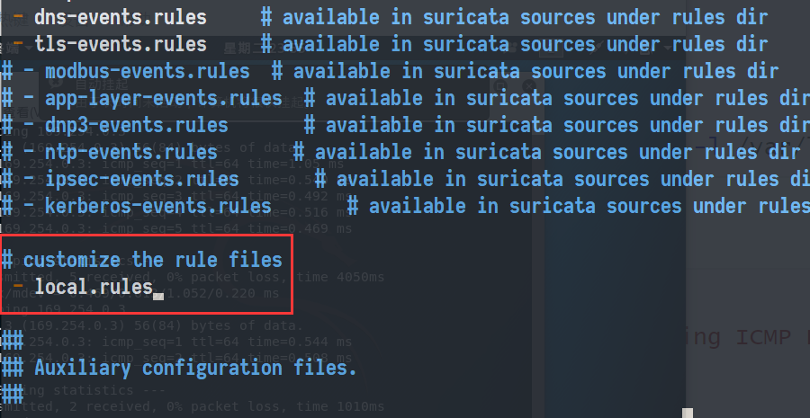

**结果**

* 查看日志，出现`alert `的`msg`

  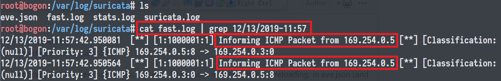

* 查看`eve.json`

  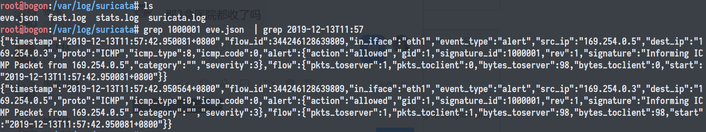

## 4. 防火墙联动

### 配置

**拓扑环境**

* `vm-1`：169.254.0.3  eth1
  * 运行 `snort\suricata` 和 `guardian.pl`
* `vm-2`：169.254.0.5 eth0
  * 运行 `nmap` 扫描`vm-1`：`nmap 169.254.0.3 -A -T4 -n -vv`

**配置guardian**

* 配置`guardian.conf`

  ```shell
  cat << EOF > guardian.conf
  HostIpAddr      1969.254.0.3
  Interface       eth1
  EOF
  ```

* 修改`guardian.pl`

  * 因为默认配置了不正确的`alert.log`地址，因此需要进行更改

    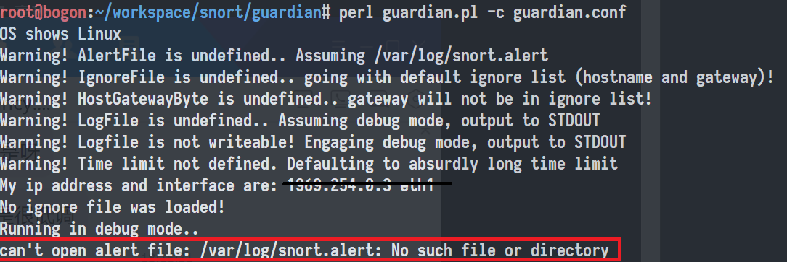

  * **Snort**：`$alert_file = /var/log/snort/alert`

  * **Suricata**：`$alert_file = /var/log/surcata/fast.log`

---

### Snort

```shell
# 开启 snort
snort -q -A fast -b -i eth1 -c /etc/snort/snort.conf -l /var/log/snort/

# 启动 guardian.pl
perl guardian.pl -c guardian.conf

# 查看iptables更新
iptables -L -n

# 清空iptables
iptables -F
```

**结果**

* `kali-victim`

  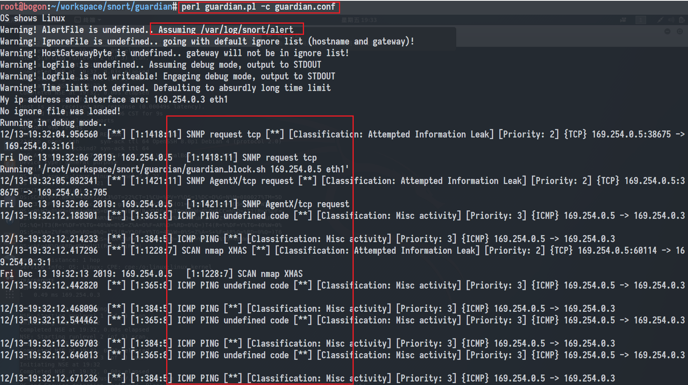

* `iptables`变化：`INPUT`黑名单

  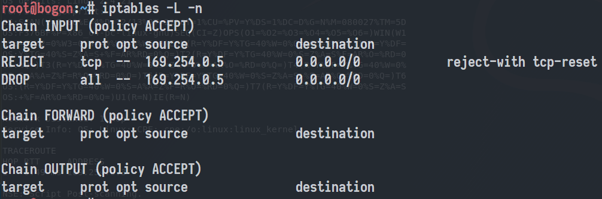

### Suricata

```shell
# 添加规则,对tcp/udp/icmp都将发出alert，并记录在fast.log中
cat << EOF > /etc/snort/rules/local.rules
alert tcp 169.254.0.5 any -> 169.254.0.3 any (msg:"Informing ICMP Packet from 169.254.0.5";sid:1000002;rev:1;)
alert udp 169.254.0.5 any -> 169.254.0.3 any (msg:"Informing ICMP Packet from 169.254.0.5";sid:1000003;rev:1;)
EOF

# 开启suricata
suricata -i eth1 -c /etc/suricata/suricata.yaml

# 启动 guardian.pl
perl guardian.pl -c guardian.conf

# 查看iptables更新
iptables -L -n

# 清空iptables
iptables -F

```

**结果**

* `kali-victim`，重复扫了多次

  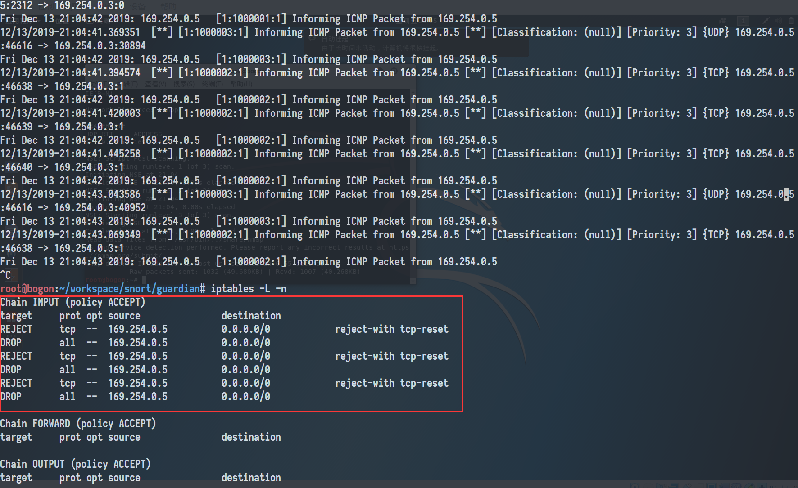

* `kali-attacker`

  * 启用`guardian`前：`nmap`扫出PORT和OS信息

    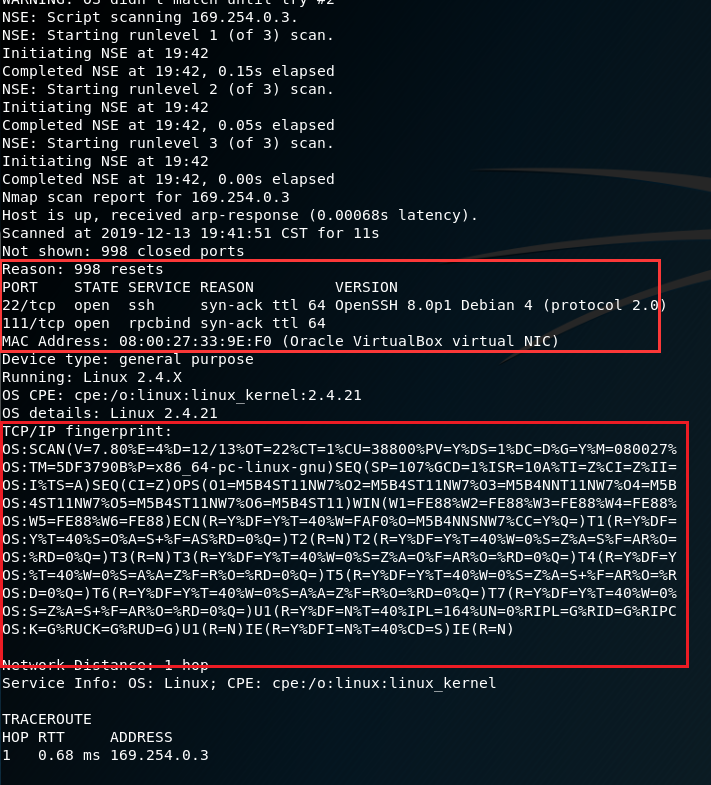

  * 后，`kali-victim`返回`reset`信息导致扫描不出端口信息，同时也扫不出OS信息

    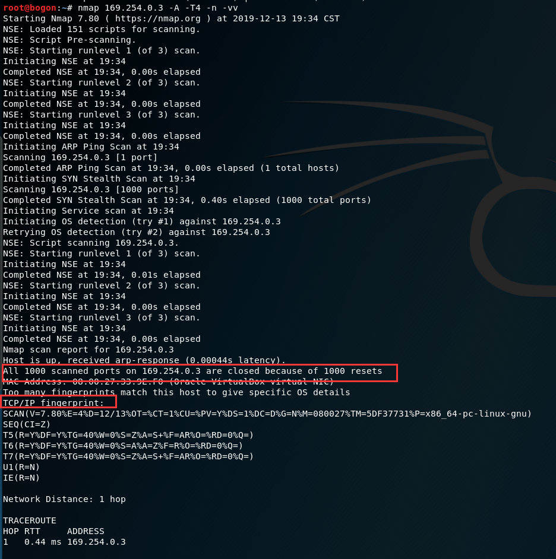

## 5. Suricata的IPS 模式

**原理**

* Suricata流量控制的两种拓扑

  * 跑在网关上

    

  * 跑在主机上

    

* Suricata分别支持在$Layer 3$和$Layer 2$的IPS Mode。本实验在$Layer 3$上进行，即利用**NFQ**

**NFQ**

> Using NFQUEUE in iptables rules, will send packets to Suricata. If the mode is set to ‘accept’, the packet that has been send to Suricata by a rule using NFQ, will by default not be inspected by the rest of the iptables rules after being processed by Suricata

---

### 实验

**配置iptables**

* 检查是否支持NFQ：`suricata --build-info`

  

* 配置`NFQ`

  ```shell
  sudo iptables -I INPUT -j NFQUEUE
  sudo iptables -I OUTPUT -j NFQUEUE
  
  # 检查配置
  sudo iptables -vnL
  
  ```

  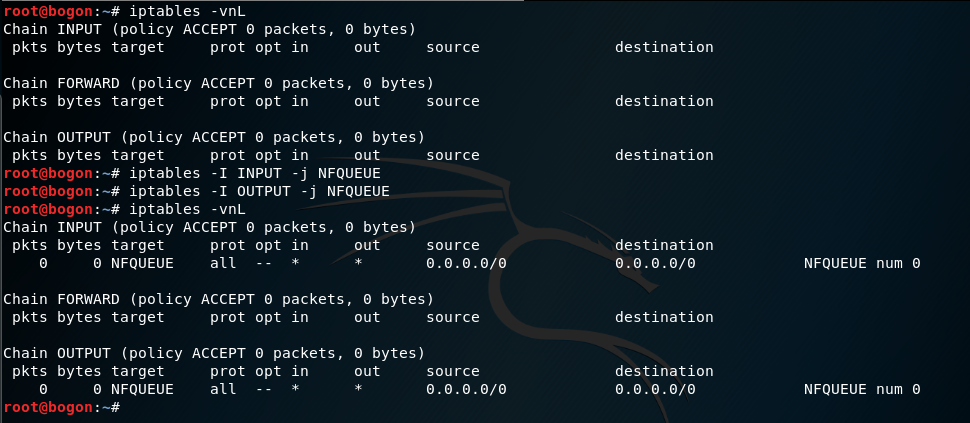

**重复实验4**

```shell
# 开启suricata
suricata -i eth1 -c /etc/suricata/suricata.yaml -q 0

# 启动 guardian.pl
perl guardian.pl -c guardian.conf

```

* `-q 0`

  > To run suricata with the NFQ mode, you have to make use of the -q option. This option tells Suricata which of the queue numbers it should use.

**结果**

* `kali-victim`

  * iptables更新

    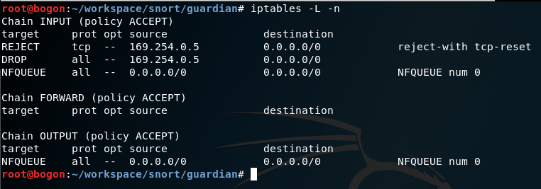

* `kali-attacker`

  * 端口探测包被过滤

  * 发送2049个包，只收到1个包

    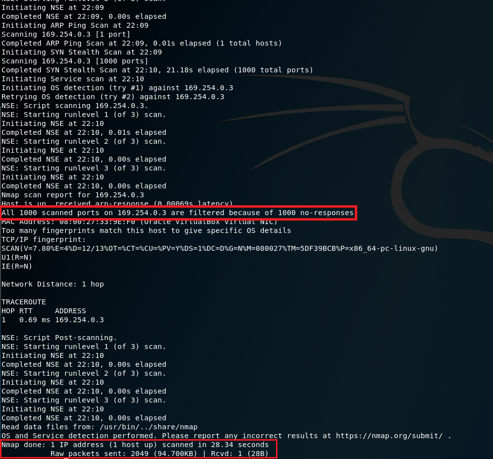

### 常见问题

* 由于配置`NFQ`时未细化到协议与端口，导致与虚拟机的SSH也被掐断了

# 总结

**相比IPS方式防御，IDS与防火墙的联动防御方式存在的缺陷**

* **IPS为主动防御**，根据设置的过滤器，分析相对应的数据包，通过检查的数据包可以继续前进，包含恶意内容的数据包就会被丢弃，被怀疑的数据包需要接受进一步的检查。而**IDS+防火墙为被动防御**，检测规则的更新总是落后于攻击手段的更新。如同本实验中，根据日志信息来对新的攻击方式更新防御规则
* IPS基于主动响应和过滤功能，可检测到传统的防火墙+IDS 方案检测不到的攻击行为。

# 参考资料

[Snort 使用手册 -IBM- ](https://www.ibm.com/developerworks/cn/web/wa-snort1/)

[Snort Users Manual (**Recommend**)](https://www.snort.org/documents/snort-users-manual)

[Suricata User Guide — Suricata unknown documentation (**Recoomend**)](https://suricata.readthedocs.io/en/suricata-5.0.0/index.html)

[manual-snort-org (**Recoomend**)](http://manual-snort-org.s3-website-us-east-1.amazonaws.com/node29.html)

[IDS与IPS功能分析-51CTO博客](https://blog.51cto.com/chenguang/73767)